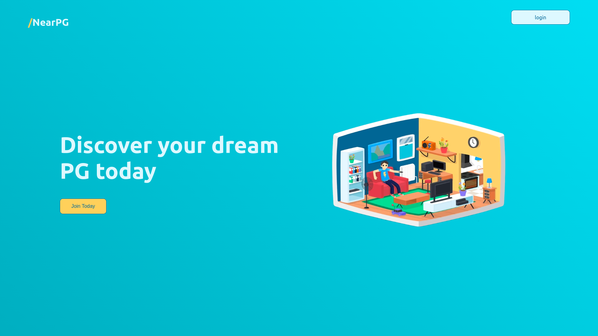
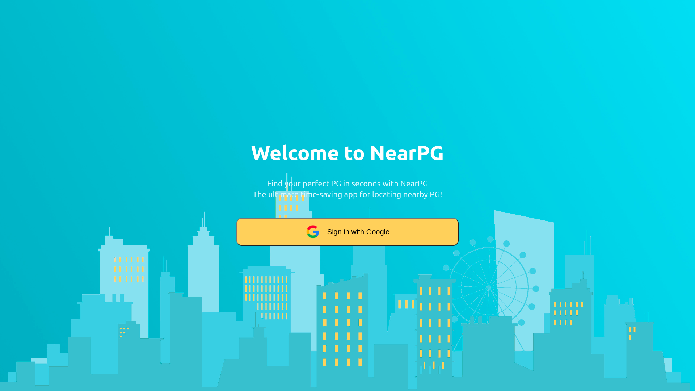
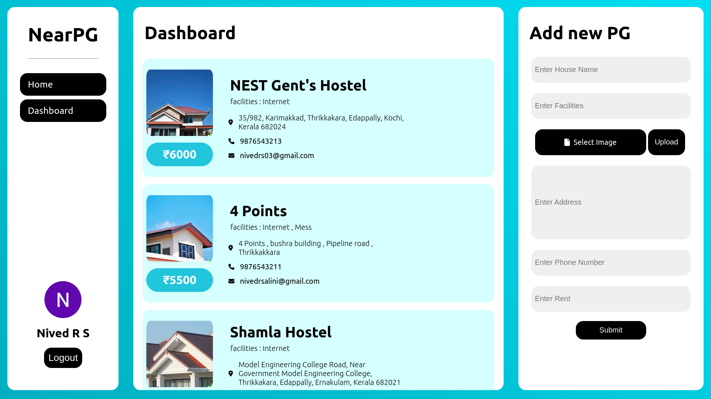

<h1 align=center> NearPG </h1>

  

A paying guest house finder app made using react and firebase .
this Project was made as a part of [WebCamp](https://www.instagram.com/p/CsOh23vP5yh/?igshid=MzRlODBiNWFlZA==) by [TinkerHubMEC](https://mec.tinkerhub.org/)

---
### Screenshots




---

### Setup

- Clone the Repository using ```git clone https://github.com/n1ved/nearpg.git```
- Setup Environment Variables
- Run ```npm start``` to run it on localhost

### Environment Variables

All Firebase API crendentials are stored inside ```.env``` file in project root 

```
REACT_APP_API_KEY
REACT_APP_AUTH_DOMAIN
REACT_APP_PROJECT_ID
REACT_APP_STORAGE_BUCKET
REACT_APP_MESSAGING_SENDER_ID
REACT_APP_APP_ID
```
